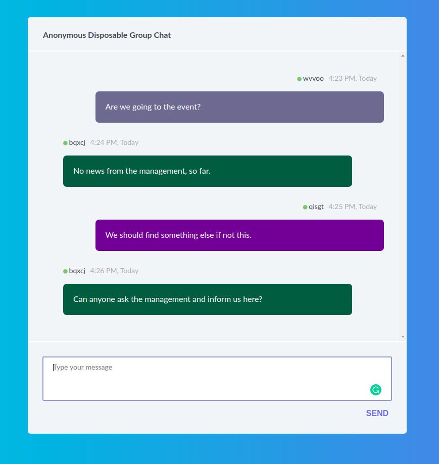

# chat-app
Anonymous Disposable Group Chat, where nothing get stored anywhere and just the people active that time will receive the messages. Chat gets deleted from the users computers as soon as they refresh. 

Stimulus
  https://stimulusjs.org/handbook/introduction
  
Ruby on Rails - ActionCable
  https://edgeguides.rubyonrails.org/action_cable_overview.html

